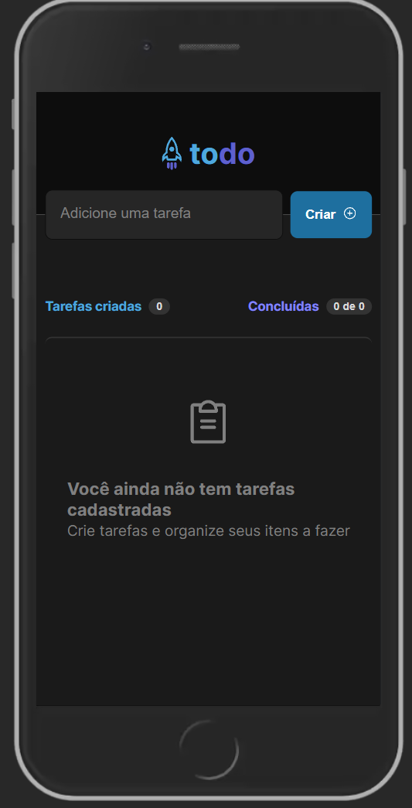
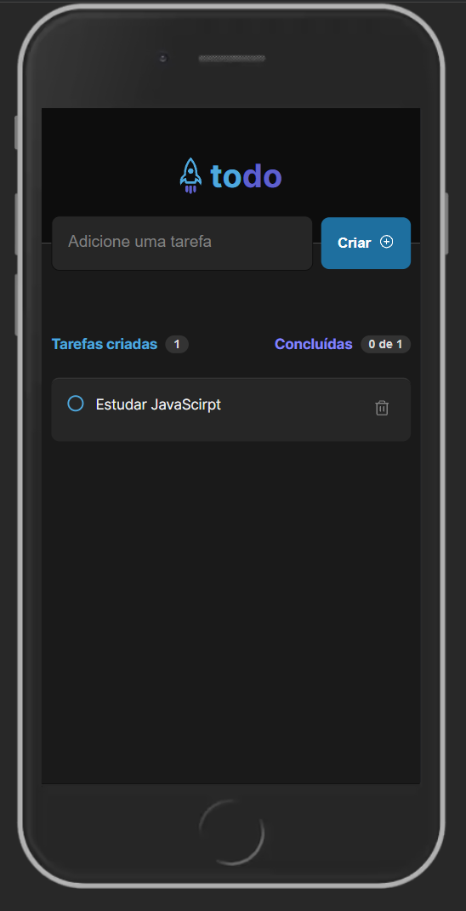
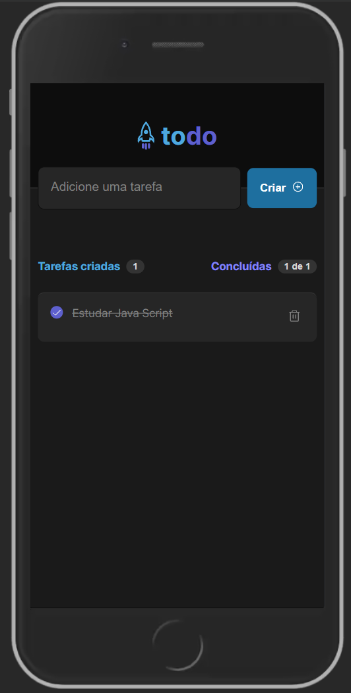
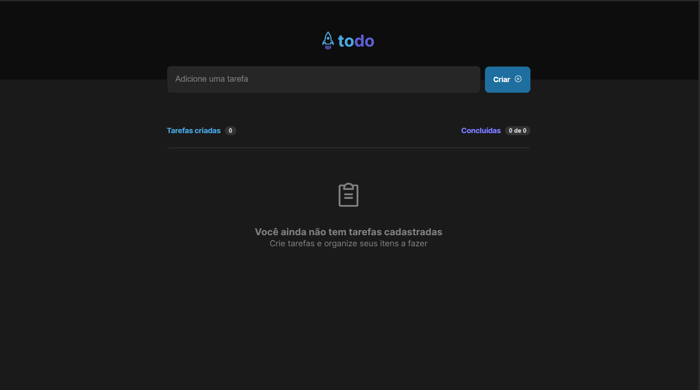
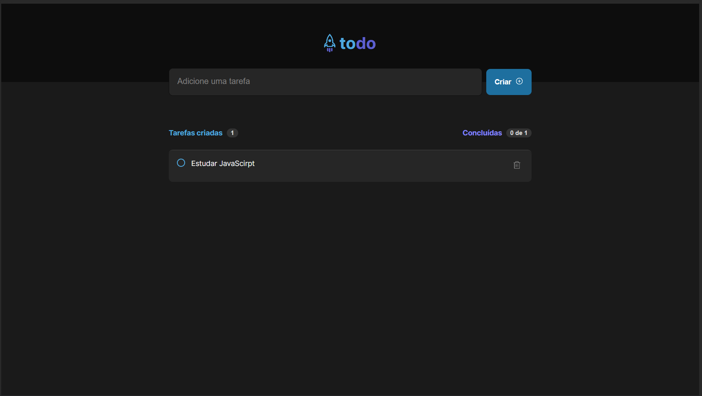
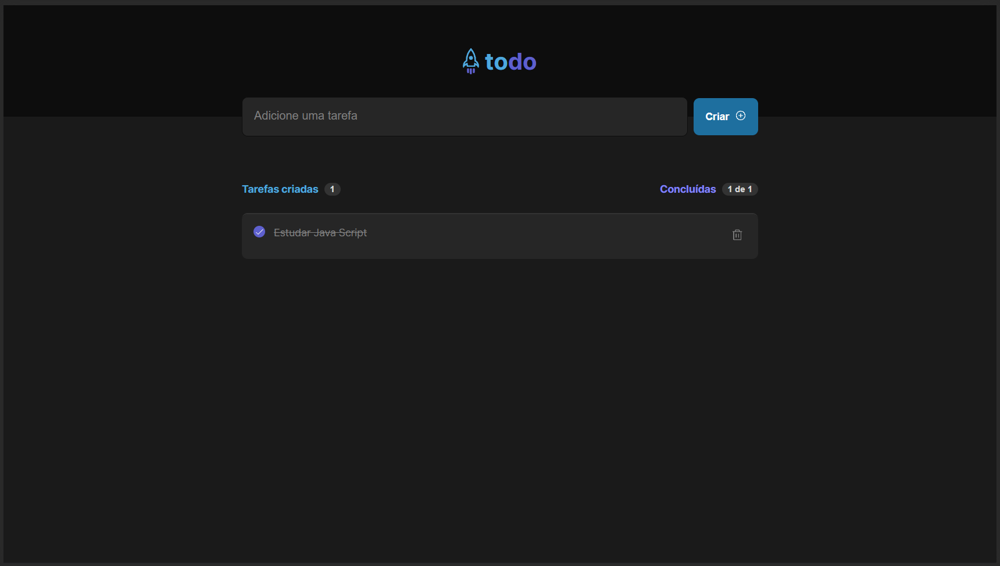

# This project is learning about React with TS and vite

## What I learned

1. How to use React with TS
2. How to use vite
3. How to use styled-components
4. How to use react-icons
5. How to use components
6. How to use hooks
7. How to use useState
8. How to use useEffect
9. How to use useRef

## How to run

1. Clone this repo
2. Run `npm install`
3. Run `npm run dev`

### Images of my project

#### Mobile

#### Desktop

